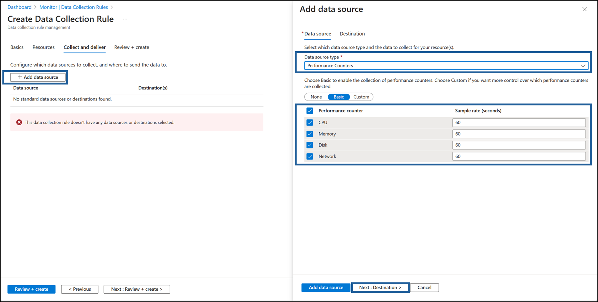

---
lab:
  title: 08 - 创建 Log Analytics 工作区、Azure 存储帐户和数据收集规则 (DCR)
  module: Module 03 - Configure and manage threat protection by using Microsoft Defender for Cloud
---

# 实验室 08：创建 Log Analytics 工作区、Azure 存储帐户和数据收集规则 (DCR)

# 学生实验室手册

## 实验室方案

作为金融技术公司的 Azure 安全工程师，你的任务是增强用于处理财务交易和管理敏感数据的所有 Azure 虚拟机 (VMs) 的监视和安全可见性。 安全团队需要这些 VM 的详细日志和性能指标，以检测潜在威胁并优化系统性能。 首席信息安全官 (CISO) 要求你实施一个解决方案，用于收集安全事件、系统日志和性能计数器。 已分配了配置 Azure Monitor 代理 (AMA) 和数据收集规则 (DCR)，以集中日志收集和性能监视。


> 对于本实验室中的所有资源，我们使用“美国东部”区域。 请与讲师确认这是课堂上所使用的区域。 

## 实验室目标

在本实验室中，你将成功完成以下练习：

- 练习 1：部署 Azure 虚拟机
- 练习 2：创建 Log Analytics 工作区
- 练习 3：创建 Azure 存储帐户
- 练习 4：创建数据收集规则
  
## 说明

### 练习 1：部署 Azure 虚拟机

### 练习计时：10 分钟

在本练习中，你将完成以下任务： 

#### 任务 1：部署 Azure 虚拟机

1. 登录到 Azure 门户 `https://portal.azure.com/`。

    >**注意**：使用此实验室使用的 Azure 订阅中具有所有者或参与者角色的帐户登录 Azure 门户。

2. 单击 Azure 门户右上角的第一个图标，打开 Cloud Shell。 如果出现提示，请选择 **PowerShell**。

3. 确保在“Cloud Shell”窗格左上角的下拉菜单中选中“PowerShell”。

4. 在“**入门**”窗口中，保留默认设置：**选择要开始使用的订阅。你可选挂载存储帐户，以在会话之间保留文件。无需提供存储帐户。**

5. 在“**订阅**”下拉菜单中，选择你的**订阅。**

6. 保留“**使用现有专用虚拟网络**”未选中状态，然后点击“**应用**”。

7. 在 Cloud Shell 窗格内的 PowerShell 会话中运行以下命令，创建一个将在本实验室中使用的资源组：
  
    ```powershell
    New-AzResourceGroup -Name AZ500LAB131415 -Location 'EastUS'
    ```

    >**备注**：此资源组将用于实验室 8、9 和 10。

8. 在“Cloud Shell”窗格的 PowerShell 会话中，运行以下命令以在主机上启用加密 (EAH)：
   
   ```powershell
    Register-AzProviderFeature -FeatureName "EncryptionAtHost" -ProviderNamespace Microsoft.Compute 
    ```

5. 在 Cloud Shell 窗格内的 PowerShell 会话中运行下列命令，创建新的 Azure 虚拟机。 

    ```powershell
    New-AzVm -ResourceGroupName "AZ500LAB131415" -Name "myVM" -Location 'EastUS' -VirtualNetworkName "myVnet" -SubnetName "mySubnet" -SecurityGroupName   "myNetworkSecurityGroup" -PublicIpAddressName "myPublicIpAddress" -PublicIpSku Standard -OpenPorts 80,3389 -Size Standard_D2_v4 
    ```
    
6.  当提示输入凭据时：

    |设置|值|
    |---|---|
    |用户 |localadmin|
    |密码|请使用在实验室 02 > 练习 2 > 任务 1 > 步骤 3 中创建的个人密码****。|

    >备注：请等待部署完成。 

7. 在 Cloud Shell 窗格中的 PowerShell 会话中运行以下命令，以确认已创建名为“myVM”的虚拟机，且其“ProvisioningState”为“成功”  。

    ```powershell
    Get-AzVM -Name 'myVM' -ResourceGroupName 'AZ500LAB131415' | Format-Table
    ```

8. 关闭 Cloud Shell 窗格。 

### 练习 2：创建 Log Analytics 工作区

### 练习计时：10 分钟

在本练习中，你将完成以下任务： 

#### 任务 1：创建 Log Analytics 工作区

此任务将创建一个 Log Analytics 工作区。 

1. 在 Azure 门户页面顶部的“搜索资源、服务和文档”文本框中，键入“Log Analytics 工作区”，然后按“Enter”键。

2. 在“Log Analytics 工作区”边栏选项卡上，单击“+ 创建” **** 。

3. 在“创建 Log Analytics 工作区”边栏选项卡的“基本设置”选项卡上，指定以下设置（其他设置保留默认值） ：

    |设置|值|
    |---|---|
    |订阅|你在此实验室中使用的 Azure 订阅的名称|
    |资源组|AZ500LAB131415|
    |名称|**lgawIgnite**|
    |区域|**美国东部**|

4. 选择“查看 + 创建”  。

5. 在“创建 Log Analytics 工作区”边栏选项卡的“查看 + 创建”选项卡中，选择“创建”  。

### 练习 3：创建 Azure 存储帐户

### 预计用时：10 分钟

在本练习中，你将完成以下任务：

#### 任务 1：创建 Azure 存储帐户

在此任务中，你将创建存储帐户。

1. 在 Azure 门户中，在 Azure 门户页面顶部的“搜索资源、服务和文档”文本框中，键入“存储帐户”，然后按 Enter 键。

2. 在 Azure 门户的“存储帐户”边栏选项卡上，单击“+ 创建”按钮以创建新的存储帐户 。

3. 在“创建存储帐户”边栏选项卡的“基本信息”选项卡上，指定以下设置（其他设置保留默认值） ：

    |设置|值|
    |---|---|
    |订阅|你在此实验室中使用的 Azure 订阅的名称|
    |资源组|AZ500LAB131415|
    **实例详细信息** |存储帐户名称|**strgactignite**|
    |区域|**（美国）EastUS**|
    |主服务 |**Azure Blob 存储或 Azure Data Lake Storage Gen 2**|
    |性能|**标准（常规用途 v2 帐户）**|
    |冗余|**本地冗余存储 (LRS)**|

5. 在“**创建存储帐户**”边栏选项卡的“**基本信息**”选项卡上，单击“**查看 + 创建**”。 验证过程完成后，单击“**创建**”。

    >**注意**：请等待存储帐户创建完成。 这大约需要 2 分钟。

### 练习 4：创建数据收集规则

### 预计用时：15 分钟

在本练习中，你将完成以下任务：

#### 任务 1：创建数据收集规则。

在此任务中，你将创建数据收集规则。

1. 在 Azure 门户中 Azure 门户页面顶部的“搜索资源、服务和文档”文本框中键入“监视”，然后按 **Enter** 键 。

2. 在“监视设置”边栏选项卡上，单击“数据收集规则” **** 。

3. 单击“**+ 创建**”按钮，创建新的数据收集规则。

4. 在“**创建数据收集规则**”边栏选项卡的“**基本信息**”选项卡中，指定以下设置：
  
    |设置|“值”|
    |---|---|
    **规则详细信息** |规则名称|**DCR1**|
    |订阅|在本实验室中正在使用的 Azure 订阅的名称|  |资源组|**AZ500LAB131415**|
    |区域|**美国东部**|
    |平台类型|**Windows**|
    |数据收集终结点|*留空*|

    


5. 单击标签为“下一步: 资源 >”的按钮以继续操作。
   
6. 在“**资源**”页上，选择“**+ 添加资源**”。

7. 在“**选择范围**”模板中，选中“**范围**”中的“**订阅**”框。

8. 在“**选择范围**”模板底部，单击“**应用**”。

9. 在“**资源**”页底部，选择“**下一步：收集和传递 >**”。

10. 单击“+ 添加数据源”，然后在“添加数据源”页上，更改“数据源类型”下拉菜单以显示“性能计数器”   。 保留以下默认设置：

    |设置|“值”|
    |---|---|
    |**性能计数器**|**采样率（秒）**|
    |CPU|60|
    |内存|60|
    |磁盘|60|
    |网络|60|

   

11. 单击标签为“下一步: 目标 >”的按钮以继续操作。
  
12. 点击“**+ 添加目标**”，更改“**目标类型**”下拉菜单以显示 **Azure Monitor 日志。** 在“订阅”窗口中，确保显示“订阅”，然后更改“帐户命名空间”下拉菜单以反映以前创建的 Log Analytics 工作区。

13. 在页面底部，单击“添加数据源”。
    
    

14. 单击“查看 + 创建”****。

    

15. 单击 **“创建”** 。

> 结果：你部署了 Azure 虚拟机、Log Analytics 工作区、Azure 存储帐户和数据收集规则，以使用 Azure Monitor 代理从虚拟机收集事件和性能计数器。

>**备注**：请勿移除此实验室中的资源，因为 Microsoft Defender for Cloud 实验室、在 “VM 上启用实时访问”实验室和 Microsoft Sentinel 实验室需要这些资源
 
