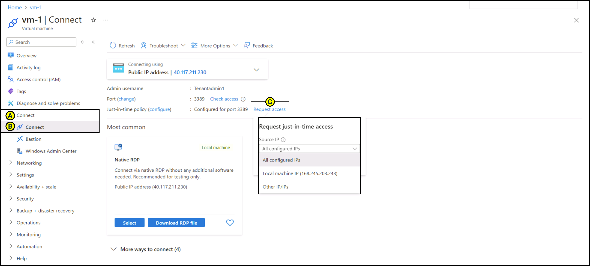

---
lab:
  title: 10 - 在 VM 上启用实时访问
  module: Module 03 - Configure and manage threat protection by using Microsoft Defender for Cloud
---

# 实验室 10：在 VM 上启用实时访问

# 学生实验室手册

## 实验室方案

作为金融服务公司的 Azure 安全工程师，你负责保护 Azure 资源，包括托管关键应用程序的虚拟机 (VM)。 安全团队发现，持续开放对 VM 的访问会增加暴力攻击和未经授权的访问的风险。 为了缓解这种情况，首席信息安全官 (CISO) 要求在用于处理财务事务的特定 Azure VM 上启用实时 (JIT) VM 访问。

## 实验室目标

在本实验室中，你将成功完成以下练习：

- 练习 1：从 Azure 门户在 VM 上启用 JIT。

- 练习 2：从 Azure 门户请求访问已启用 JIT 的 VM。

## 练习说明 

### 练习 1：从 Azure 虚拟机对 VM 启用 JIT

>**注意**：可以从 Azure 门户的 Azure 虚拟机页面对 VM 启用 JIT。

1. 在门户顶部的搜索框中，输入“虚拟机”。 在搜索结果中，选择“虚拟机”。

2. 选择“myVM”。
 
3. 从 **myVM.** 的“**设置**”部分选择“**配置**”。
   
4. 在“**实时 VM 访问**”下，选择**启用实时。**

5. 在**即时虚拟机**访问下，单击 **Open Microsoft Defender for Cloud** 链接。

6. 默认情况下，VM 的实时访问使用以下设置：

   - Windows 计算机
   
     - RDP 端口：3389
     - 允许的最长访问时间：三小时
     - 允许的源 IP 地址：任意

   - Linux 计算机
     - SSH 端口：22
     - 允许的最长访问时间：三小时
     - 允许的源 IP 地址：任意
   
7. 默认情况下，VM 的实时访问使用以下设置：

   - 在**已配置**选项卡上，右键单击要向其添加端口的 VM，然后选择编辑。

   
   
   - 在**JIT VM 访问配置**下，可以编辑已保护的端口的现有设置，也可以添加新的自定义端口。
   - 编辑完端口后，选择**保存**。   

### 练习 2：从 Azure 虚拟机的连接页请求访问启用了 JIT 的 VM。

>**注意**：如果 VM 启用了 JIT，则必须请求连接到它所需的访问权限。 不管你启用 JIT 的方式如何，你都可以通过任何受支持的方式请求访问权限。
   
1. 在 Azure 门户中，打开虚拟机页面。

2. 选择要连接到的 VM，然后打开**连接**页。

   - Azure 会查看是否已在该 VM 上启用了 JIT。

        - 如果没有为该 VM 启用 JIT，系统会提示你启用它。
    
        - 如果启用了 JIT，则选择**请求访问**，以便传递访问请求，其中包含已为该 VM 配置的请求 IP、时间范围和端口。
    
   

> **结果**：你已探索了有关如何在 VM 上启用 JIT 的各种方法，以及如何请求访问在 Microsoft Defender for Cloud 中启用了 JIT 的 VM。
